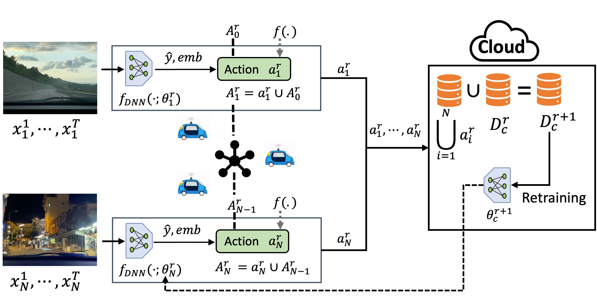
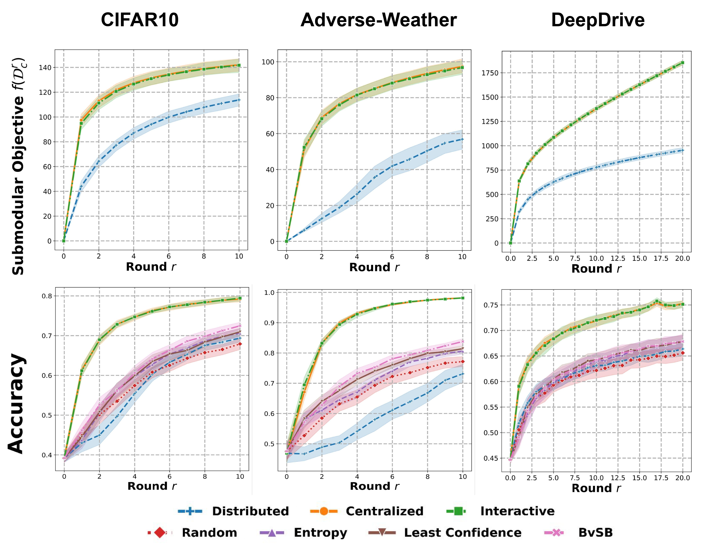

# Fleet Active Learning: A Submodular Maximization Approach
This repository contains the code for the paper [Fleet Active Learning: A Submodular Maximization Approach](https://openreview.net/forum?id=low-53sFqn)

## Table of Contents
- [TLDR](#TLDR)
- [Abstract](#abstract)
- [System Overview](#system-overview)
- [Experimental Results](#experimental-results)
- [Installation](#installation)
  - [Packages](#packages)
  - [Dataset](#dataset)
- [How to run](#how-to-run)
- [Citation](#citation)

## TLDR

This work introduces a fleet active learning framework for multi-robot systems.

## Abstract

<details>
<summary>Click to expand</summary>
In multi-robot systems, robots often gather data to improve the performance of their deep neural networks (DNNs) for perception and planning. Ideally, these robots should select the most informative samples from their local data distributions by employing active learning approaches. However, when the data collection is distributed among multiple robots, redundancy becomes an issue as different robots may select similar data points. To overcome this challenge, we propose a  fleet active learning (FAL) framework in which robots collectively select informative data samples to enhance their DNN models. Our framework leverages submodular maximization techniques to prioritize the selection of samples with high information gain. Through an iterative algorithm, the robots coordinate their efforts to collectively select the most valuable samples while minimizing communication between robots. We provide a theoretical analysis of the performance of our proposed framework and show that it is able to approximate the NP-hard optimal solution. We demonstrate the effectiveness of our framework through experiments on real-world perception and classification datasets, which include autonomous driving datasets such as Berkeley DeepDrive. Our results show an improvement by up to 25.0% in classification accuracy, 9.2% in mean average precision and 48.5% in the submodular objective value compared to a completely distributed baseline.
</details>

## System Overview


**Fleet Active Learning Framework:** Each robot $i$ observes a stream of data points $x_i^1,\ldots,x_i^T$ and processes them using its neural network $f_{\mathrm{DNN}}(\cdot;\theta_i^r)$ to obtain predictions $\hat{y}$ and embeddings $emb$. Then, robots utilize these embeddings and predictions to select an action $a_i^r$ to sample data points, maximizing a submodular function $f$ while considering the previous robots' actions $A_{i-1}^r$. The aggregated action $A_i^r = a_i^r \cup A_{i-1}^r$ is passed to the next robot, repeating the process until all robots have taken an action. At the end of each round, the actions are shared with the cloud, which labels the newly acquired data points and updates the training dataset $\mathcal{D}_c^{r}$ with newly acquired data points $\bigcup_{i=1}^{N} a_i^r$, resulting in the creation of a new dataset $\mathcal{D}_c^{r+1}$. The model is retrained with the new dataset, yielding $\theta^{r+1}_c$. Finally, the cloud shares the updated model weights with all robots, and each robot updates its model parameters accordingly. 

## Experimental Results

 

**Experimental Results:** Each column represents a different dataset. *Row 1* shows the submodular objective of the cloud dataset across the rounds. Both the **_Centralized_** and **_Interactive_** policies achieve similar objectives, while the **_Distributed_** fails to reach the same level of performance. *Row 2* presents the accuracy of the retrained neural networks using the dataset $\mathcal{D}_c^{r}$ in each round $r$. The accuracy plots exhibits a similar trend as the submodular objective, with the **_Interactive_** and **_Centralized_** policies consistently outperforming other benchmark policies.

## Installation
### Packages
For the installation of the required packages please run the following command:
```bash
pip install -r requirements.txt
```
### Datasets
The MNIST and CIFAR10 datasets are automatically downloaded by the PyTorch package. <br />
The Advere-Weather dataset can be downloaded from
[Adverse-Weather](http://sar-lab.net/adverse-weather-dataset/#:~:text=This%20dataset%20entails%20tens%20of,overcast%2C%20sunny%2C%20and%20cloudy.) <br />
The Berkeley DeepDrive dataset can be downloaded from
[Berkeley DeepDrive](https://bdd-data.berkeley.edu/)

## How to run
To run experiments on different datasets, please run the following commands:
For MNIST:
```bash
run_exps/run_mnist.sh
```
For CIFAR10:
```bash
run_exps/run_cifar10.sh
```
For Adverse-Weather:
```bash
run_exps/run_adverse_weather.sh
```
For Berkeley DeepDrive:
```bash
run_exps/run_berkeley_deepdrive.sh
```

## Citation
Please cite our paper if you find this work useful for your research:
```
@inproceedings{
akcin2023fleet,
title={Fleet Active Learning: A Submodular Maximization Approach},
author={Oguzhan Akcin and Orhan Unuvar and Onat Ure and Sandeep P. Chinchali},
booktitle={7th Annual Conference on Robot Learning},
year={2023},
url={https://openreview.net/forum?id=low-53sFqn}
}
```